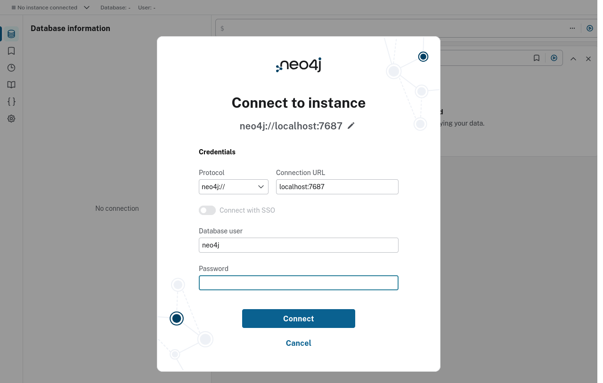
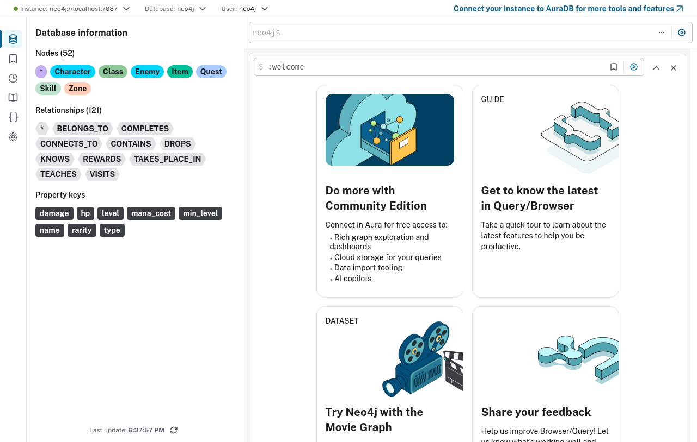
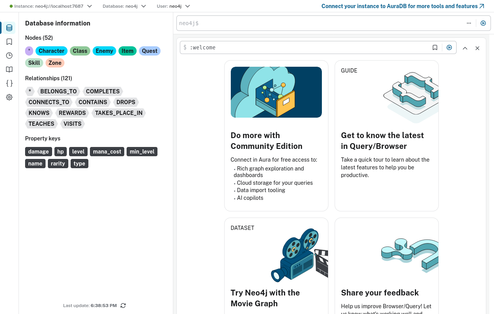
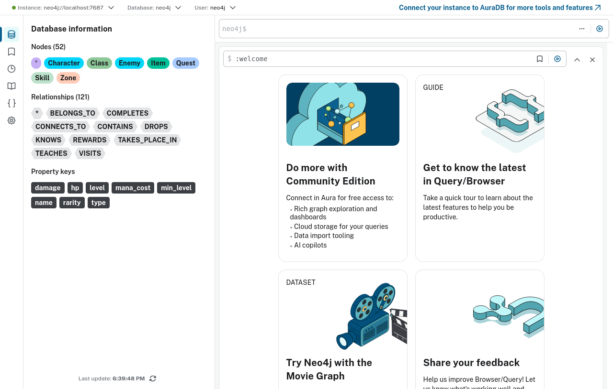
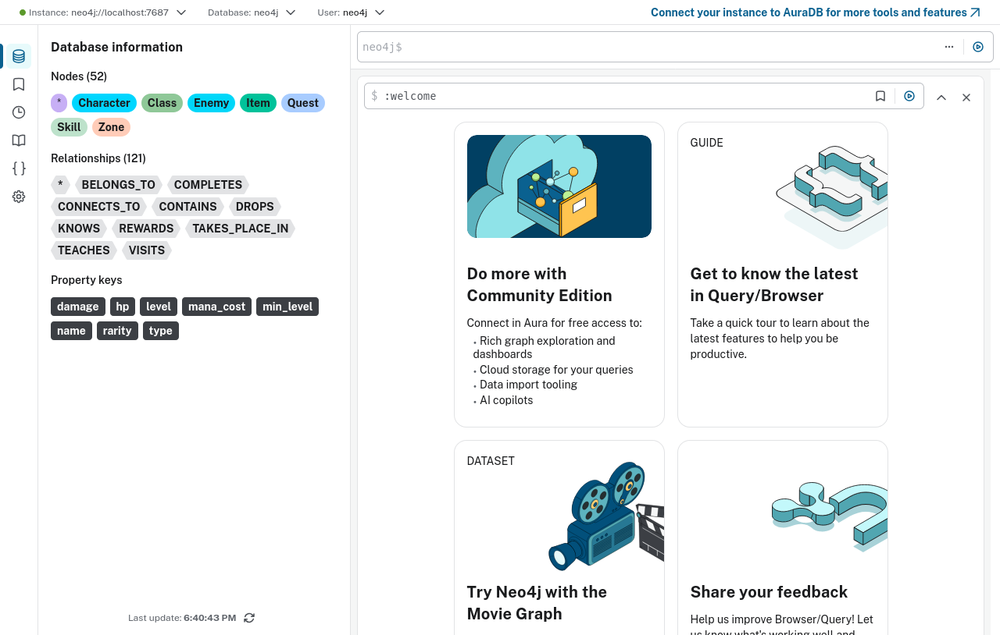
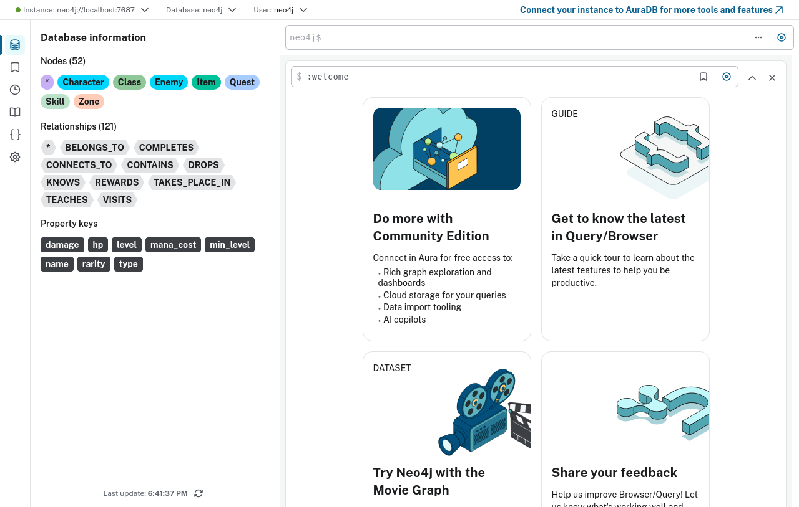
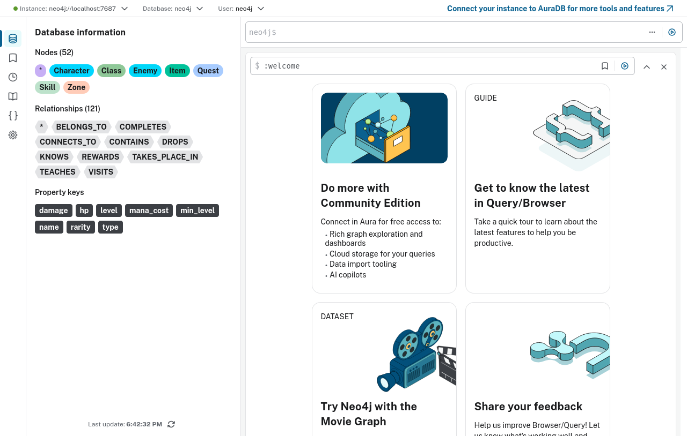
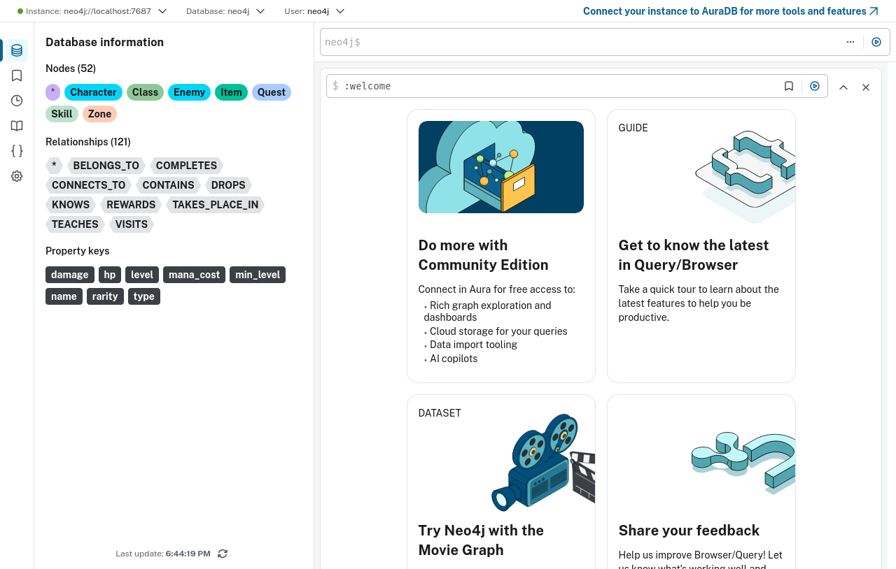
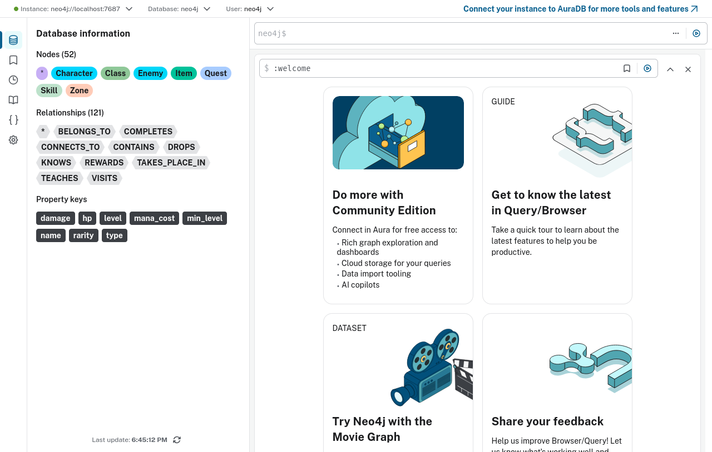

# Manual de Neo4j — Casos de uso con dominio RPG

Este manual explora las capacidades de Neo4j usando un catálogo de juego RPG como datos de ejemplo. Cubre desde las operaciones básicas hasta algoritmos avanzados de grafos.

**Requisitos previos**
```bash
docker compose up -d          # Neo4j corriendo
source .venv/bin/activate
python data/seed.py           # cargar datos RPG
```

**Acceso**: `http://localhost:7474` · usuario `neo4j` · contraseña `titanpoc`

---

## 1. Login y conexión

Al abrir el browser por primera vez aparece el formulario de conexión. Neo4j Browser es la consola oficial — permite ejecutar Cypher, visualizar grafos de forma interactiva y explorar el esquema.



**Campos:**
- **Connect URL**: `bolt://localhost:7687` (protocolo binario eficiente)
- **Username** / **Password**: credenciales del servidor

---

## 2. Esquema del grafo

```cypher
CALL db.schema.visualization()
```

Neo4j no tiene esquema fijo — se infiere dinámicamente de los datos. Este procedimiento muestra todos los **labels** (tipos de nodo) y **tipos de relación** presentes, con las conexiones entre ellos.



**Qué ves:**
- Burbujas de colores = tipos de nodo (Character, Zone, Enemy, Item, Quest, Class, Skill)
- Flechas etiquetadas = relaciones (BELONGS_TO, KNOWS, VISITS, CONTAINS, DROPS…)
- Es el "ERD" de Neo4j, pero orientado a grafos

**Por qué importa:** en Neo4j el esquema es emergente. No declaras tablas ni columnas con antelación — los nodos y relaciones se crean con las propiedades que necesites en cada momento.

---

## 3. Grafo RPG completo

```cypher
MATCH (n)-[r]->(m) RETURN n,r,m LIMIT 80
```

Vista completa del dataset RPG: todos los nodos y relaciones del mundo.



**Qué ves:** el grafo renderizado con D3.js. Cada tipo de nodo tiene un color diferente. Las aristas son dirigidas (flecha indica dirección de la relación). Puedes **hacer clic** en cualquier nodo para ver sus propiedades, **arrastrar** para reorganizar el layout, y **hacer doble clic** para expandir los vecinos.

**Diferencia clave vs SQL:** no hay JOINs. La navegación es directa por aristas — O(camino) independientemente del tamaño del grafo.

---

## 4. Explorar un nodo: Seraphia y sus conexiones

```cypher
MATCH (c:Character {name:'Seraphia'})-[r]-(n) RETURN c,r,n
```

Muestra todos los vecinos directos de Seraphia: su clase, las habilidades que conoce, las zonas que ha visitado y las quests completadas.



**Patrón `(a)-[r]-(b)`**: sin dirección de flecha — devuelve relaciones en ambas direcciones.

**Variante dirigida** — solo lo que Seraphia conoce/visita/completa:
```cypher
MATCH (c:Character {name:'Seraphia'})-[r]->(n) RETURN c,r,n
```

---

## 5. Red de zonas — mapa del mundo

```cypher
MATCH (a:Zone)-[r:CONNECTS_TO]->(b:Zone) RETURN a,r,b
```

Visualiza el mapa de zonas del mundo RPG como un grafo de conectividad. Cada nodo es una zona; las aristas son rutas transitables.



**Propiedad `level`** en cada zona indica el nivel recomendado. La estructura del grafo representa la progresión natural del jugador.

---

## 6. Camino más corto entre zonas

```cypher
MATCH (a:Zone {name:'Aldea Inicial'}),(b:Zone {name:'Torre del Mago'})
MATCH p = shortestPath((a)-[:CONNECTS_TO*]-(b))
RETURN p
```

`shortestPath()` es un algoritmo **built-in** de Neo4j. Encuentra el camino de menor número de saltos entre dos nodos. No requiere ningún plugin externo.



**Variante — todos los caminos óptimos:**
```cypher
MATCH p = allShortestPaths((a)-[:CONNECTS_TO*]-(b))
RETURN p
```

**Variante — limitar profundidad máxima:**
```cypher
MATCH p = shortestPath((a)-[:CONNECTS_TO*..4]-(b))
RETURN p
```

**Por qué es poderoso:** en una base de datos relacional necesitarías una consulta recursiva (CTE) o una extensión como pgRouting. En Neo4j es una función de primera clase.

---

## 7. Consulta tabular: ranking de personajes

```cypher
MATCH (c:Character)-[:BELONGS_TO]->(cl:Class)
RETURN c.name AS Nombre, c.level AS Nivel, c.hp AS HP, cl.name AS Clase
ORDER BY c.level DESC
```

Los resultados tabulares se muestran en la vista **Table** del Browser. Cypher soporta `ORDER BY`, `LIMIT`, `SKIP` (paginación), `WHERE`, `WITH` (subconsultas encadenadas) y `UNWIND` (aplanar listas).



**Alternar entre vista grafo y tabla:** usa los botones en la esquina superior derecha de cada frame de resultado.

---

## 8. Cadena multi-hop: zona → enemigo → loot

```cypher
MATCH (z:Zone)-[:CONTAINS]->(e:Enemy)-[:DROPS]->(i:Item)
RETURN z.name AS Zona, e.name AS Enemigo,
       i.name AS Item, i.rarity AS Rareza
ORDER BY i.rarity
```

Traversal de 3 niveles de profundidad en una sola query. En SQL esto requeriría 2 JOINs explícitos; en Cypher el patrón refleja directamente la estructura del grafo.


**Rareza de items:** `común` → `raro` → `épico` → `legendario`

---

## 9. Recomendación colaborativa

```cypher
MATCH (yo:Character {name:'Aldric'})-[:COMPLETES]->(q:Quest)
      <-[:COMPLETES]-(similar:Character)
       -[:COMPLETES]->(nueva:Quest)
WHERE NOT (yo)-[:COMPLETES]->(nueva)
RETURN nueva.name AS Quest,
       count(DISTINCT similar) AS Popularidad
ORDER BY Popularidad DESC
```

**Filtrado colaborativo puro en Cypher**: encuentra quests completadas por personajes que comparten quests con Aldric, excluyendo las que Aldric ya completó. El mismo patrón usado en sistemas de recomendación reales (Netflix, Amazon, Spotify).



**Lectura del patrón:**
1. Aldric completó quest Q
2. Otro personaje también completó Q (→ es "similar")
3. Ese personaje completó otra quest N que Aldric no hizo
4. Contar cuántos "similares" completaron N → score de popularidad

---

## 10. GDS: PageRank — nodos más influyentes

```cypher
-- Paso 1: proyectar el grafo en memoria
CALL gds.graph.project('mi_grafo', ['Character','Zone','Enemy',...], {...})
YIELD graphName

-- Paso 2: ejecutar PageRank
CALL gds.pageRank.stream('mi_grafo', {maxIterations:20, dampingFactor:0.85})
YIELD nodeId, score
RETURN gds.util.asNode(nodeId).name AS Nodo,
       labels(gds.util.asNode(nodeId))[0] AS Tipo,
       round(score,4) AS Score
ORDER BY Score DESC LIMIT 10
```

El plugin **Graph Data Science (GDS)** implementa PageRank (el algoritmo original de Google). Mide la importancia relativa de un nodo según cuántos nodos importantes apuntan a él.



**Flujo GDS:**
1. `gds.graph.project()` — carga un subgrafo en RAM (proyección in-memory)
2. `gds.pageRank.stream()` — ejecuta el algoritmo sobre la proyección
3. `gds.graph.drop()` — libera memoria

**Otros algoritmos GDS disponibles (446 en total):**

| Algoritmo | Función | Caso de uso |
|---|---|---|
| `gds.betweenness.stream` | Centralidad de intermediación | Nodos "puente" críticos |
| `gds.louvain.stream` | Detección de comunidades | Agrupar nodos relacionados |
| `gds.nodeSimilarity.stream` | Similitud Jaccard | Recomendaciones |
| `gds.shortestPath.dijkstra.stream` | Dijkstra ponderado | Rutas con coste |
| `gds.knn.stream` | K vecinos más cercanos | Clustering por similitud |

---

## Referencia rápida de Cypher

| Cláusula | Para qué |
|---|---|
| `MATCH (n:Label {prop:val})-[r:REL]->(m)` | Buscar patrones en el grafo |
| `WHERE n.prop > 10 AND NOT EXISTS {...}` | Filtrar resultados |
| `RETURN n.name, count(m), collect(m.name)` | Proyectar y agregar |
| `ORDER BY x DESC LIMIT 10` | Ordenar y paginar |
| `WITH ... WHERE ...` | Subconsultas encadenadas |
| `MERGE (n:Label {id: $id})` | Upsert idempotente |
| `CREATE (a)-[:REL {prop:val}]->(b)` | Crear relación con propiedades |
| `DETACH DELETE n` | Eliminar nodo + sus relaciones |
| `SET n.prop = $val` | Actualizar propiedades |
| `UNWIND list AS item` | Aplanar lista a filas |
| `shortestPath((a)-[:R*]-(b))` | Camino más corto |
| `(a)-[:R*1..5]->(b)` | Traversal a profundidad variable |

---

## Comandos útiles en el Browser

```cypher
:sysinfo                          -- Estado del servidor (memoria, transacciones)
:schema                           -- Índices y constraints
CALL db.labels()                  -- Ver todos los labels
CALL db.relationshipTypes()       -- Ver todos los tipos de relación
CALL db.indexes()                 -- Ver índices
CALL gds.list() YIELD name        -- Ver los 446 algoritmos GDS disponibles
```
